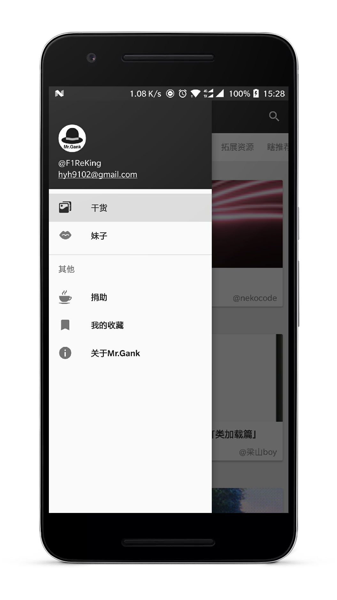
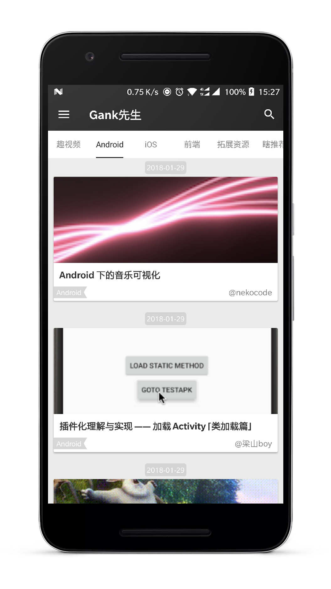
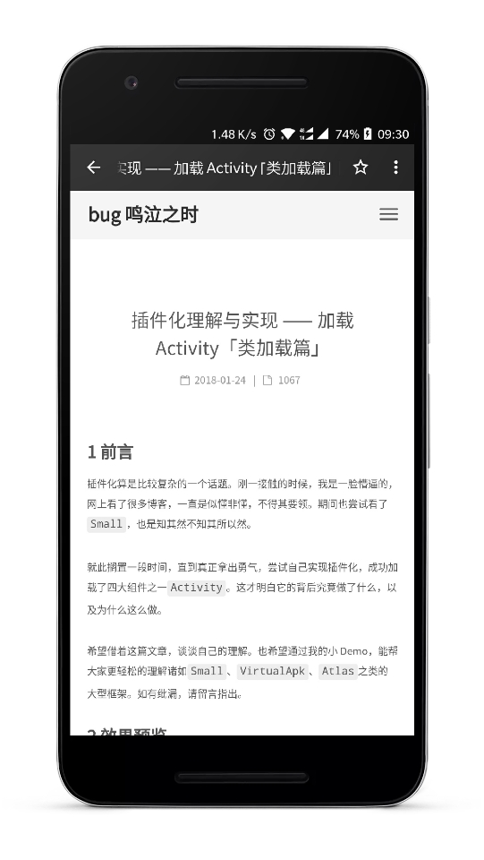
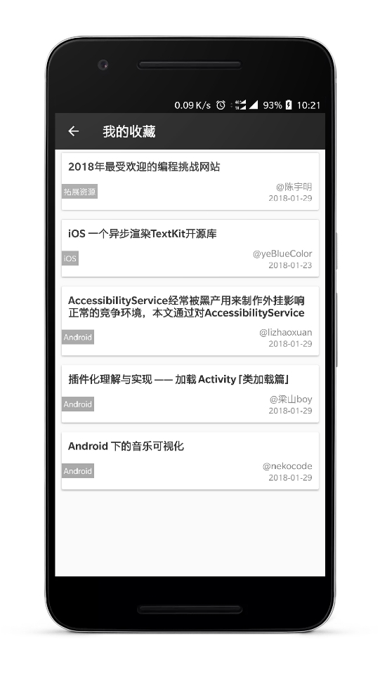

# Gank先生
程序员的好朋友，上下班途中的技术阅读器，提供IT技术分享及妹子图分享给好友，可以方便收藏喜欢的文章


## 功能

1. 查看技术分享文章
2. 保存妹子图及分享给微信QQ好友
3. 搜索技术文章
4. 收藏好文

## 下载


[Google Play下载](https://play.google.com/store/apps/details?id=com.f1reking.gank)

[酷安下载](https://www.coolapk.com/apk/175887)

## Screenshots

<a href="art/gank01.jpeg"></a>
<a href="art/gank02.jpeg"></a>
<a href="art/gank03.jpeg"></a>

<a href="art/gank04.jpeg"></a>
<a href="art/gank05.jpeg"></a>
<a href="art/gank06.jpeg"></a>

## 版本开发记录
#### 2018-2-9          v2.0.0
- 调整app主页布局
#### 2018-2-7          v1.7
- 新增捐助功能
#### 2018-2-2          v1.6
- 新增状态布局切换view
- 新增文章详情侧滑返回
- 替换数据库支持为greenDAO
- 修改web分享，打开，复制当前地址
#### 2018-1-28         v1.5
- 新增启动页面
- 优化web重新加载问题
#### 2018-1-25         v1.4
- 优化避免Fragment重叠
- 修改web页面标题跑马灯效果
#### 2018-1-24         v1.3
- 修复妹子图大小乱跳问题
- 重新定义我的收藏入口
#### 2018-1-22         v1.2
- 加入收藏功能
- 加入搜索功能
#### 2018-1-19         v1.1
- 加入bugly升级
- 新增运行时权限
- 新增首页双击退出app
#### 2018-1-18         v1.0
- 应用初始化上线
- 妹子图保存及分享功能

## License

```
 Copyright (c) 2018 F1ReKing

 Licensed under the Apache License, Version 2.0 (the "License");
 you may not use this file except in compliance with the License.
 You may obtain a copy of the License at

     http://www.apache.org/licenses/LICENSE-2.0

 Unless required by applicable law or agreed to in writing, software
 distributed under the License is distributed on an "AS IS" BASIS,
 WITHOUT WARRANTIES OR CONDITIONS OF ANY KIND, either express or implied.
 See the License for the specific language governing permissions and
 limitations under the License.
```


